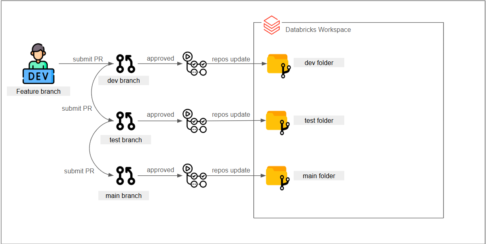
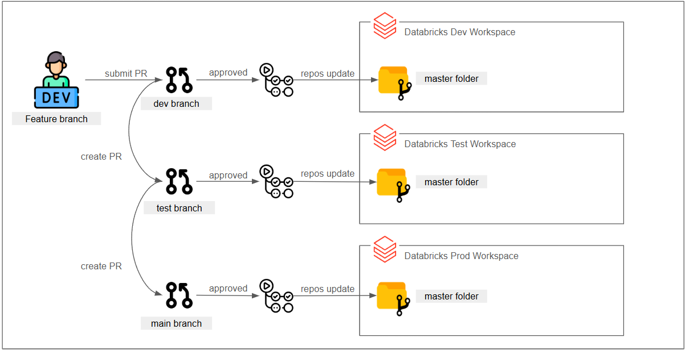

# Databricks CI/CD with Git Folders & Repos API  

This repository explores a CI/CD workflow in Databricks using Git folders and the Repos API. It demonstrates how to synchronize code across different environments (Dev, Test, Prod) using GitHub Actions.  

## 🔹 Overview  

- Uses **Git folders** to manage environment-specific code versions.  
- Automates syncing of Databricks Repos via GitHub Actions.  
- Simulates environment separation within a **single** Databricks workspace (free trial setup).  
- Demonstrates CI/CD implementation with **Databricks CLI** and **GitHub Actions**.  

## 🖼️ Architecture  

### **Free Trial Setup (Single Workspace)**  
  

### **Recommended Setup (Multiple Workspaces)**  
  

🔹 **Note:** If using multiple Databricks workspaces, repo paths can be uniform across environments. However, in a free trial setup, each environment needs a separate repo path.  

## 📖 Full Article  

For a detailed explanation, check out my article:  
👉 [Implementing CI/CD in Databricks Using Repos API](https://medium.com/@melbdataguy/implementing-ci-cd-in-databricks-using-repos-api-0c39c655d485)  